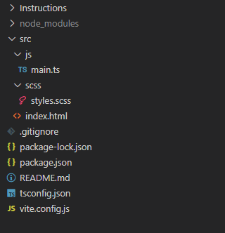

# Lab: Poetry Pages

For this lab you will write a responsive website that works well both on mobile devices and browsers. 

- [Lab: Poetry Pages](#lab-poetry-pages)
  - [:star: Learning Outcomes :star:](#star-learning-outcomes-star)
  - [:fire: Tasks](#fire-tasks)
    - [Environment Setup](#environment-setup)
  - [🚨 Submission Instructions](#-submission-instructions)
  - [:memo: Rubric](#memo-rubric)


## :star: Learning Outcomes :star:
* Use the bootstrap framework for interactive components and styling
* Write SASS to SCSS
* Make use of vite for local development
* Host the website using github pages


## :fire: Tasks

### Environment Setup

1. Go into your project directory, and run 
    ```terminal
    npm init -y
    ```
    This will create a package.json for you.
2. Add [vite](https://vite.dev/) by running.
   ```terminal
    npm i --save-dev vite
    ```
    Vite will handle building your project and hosting your website locally.
3. Add [Bootstrap](https://getbootstrap.com/).
   ```terminal
   npm i --save bootstrap @popperjs/core
   ```
   Bootstrap is a front end (html/css/javascript) framework to help
   build responsive websites with common interactive components. 
4. Add Typescript
   ```terminal
   npm i --save typescript
   ```
5. Add sass
   ```terminal
   npm i --save-dev sass
   ```
   sass is an intermediate language that will compile into SCSS (CSS). It allows
   variables, multiple files, and more developer focused features that CSS doesn't have. It is commonly used in bootstrap and other frameworks. 
6. Add gh-pages (for hosting)
   ```terminal
   npm -i --save-dev gh-pages
   ```
   Will allow us to use github pages for hosting. 
7. Add the following folders and files. For adding files, you can either use `touch` or `code` depending on your system. For example, to create an empty main.ts file, you can use `code src/js/main.ts` then save the empty file.
   * Add directories: src, src/js, src/sass
   * Create files: src/js/main.ts, src/sass/styles.scss, vite.config.js

By the end of step seven, your project directory should look like the following.




## 🚨 Submission Instructions

Submit via the assignment link in canvas. You will submit a link to your github repository for this assignment.  

## :memo: Rubric

For labs, TAs will check to see if you completed the lab, but the grade is you completed it or not. 


[Discussion Item]: ../README.md#Discussion%20Items